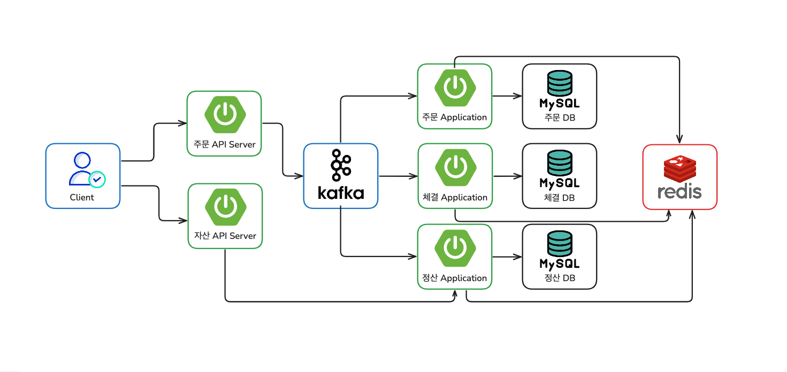
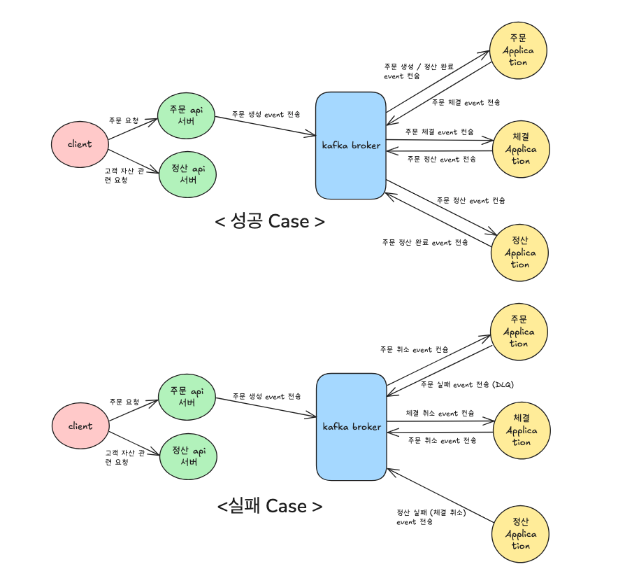
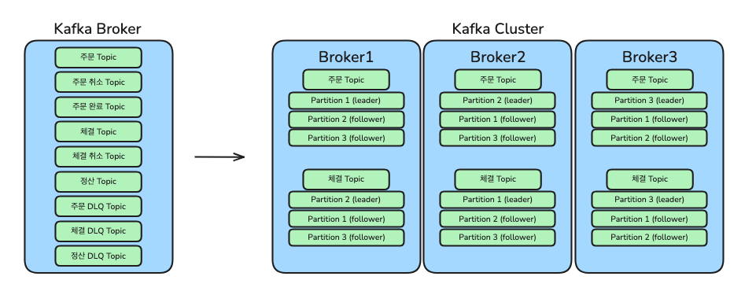

# 가상자산 거래소 백엔드 서버

---
- 이 프로젝트는 이벤트 기반 마이크로서비스 아키텍처로 구현한 가상자산 거래소의 백엔드 시스템입니다.  
- 카프카(Kafka)를 통해 주문, 체결, 정산 이벤트를 비동기적으로 처리하며, API 서버와 핵심 로직(주문, 체결, 정산)을 
각각 독립된 마이크로서비스로 구성하여 안정성과 확장성을 확보했습니다.  
- 자세한 구조 및 추가 설명은 아래의 구조도와 함께 확인하실 수 있습니다.

--- 

## 📝 프로젝트 구조도

### ✨ 이벤트 기반 데이터 처리 흐름
- 클라이언트는 주문 시 주문 API 서버에, 고객 자산 확인 시에는 자산 API 서버에 각각 요청합니다. ([기술적 이슈 해결과정 [#1]](#issue_case))
- 주문 API 서버는 주문 요청을 받아 카프카 브로커로 주문 생성 이벤트를 비동기 발행하고, 자산 API 서버는 자산 확인 
요청 시 정산 애플리케이션으로부터 고객 자산을 동기 조회하여 응답받습니다.
- 주문 생성 이벤트가 발행되면, 주문 애플리케이션이 이를 컨슘하여 주문 데이터를 생성하고 후속으로 체결 이벤트를 발행합니다.
- 이어서 체결 애플리케이션이 체결 이벤트를 컨슘하여 체결을 처리하고 정산 이벤트를 발행하면, 정산 애플리케이션이 이어서 
정산을 완료하고 정산 완료 이벤트를 발행합니다.
- 마지막으로 주문 애플리케이션이 정산 완료 이벤트를 다시 컨슘하여, 해당 주문 데이터의 상태를 '완료'로 업데이트하며 
모든 과정이 종료됩니다.
- 위 과정에서 발생할 수 있는 이벤트 중복 처리를 방지하기 위해, Redis 를 이용해 이벤트 키의 존재 여부를 확인하는 
방식으로 멱등성을 보장했습니다. (자세한 내용 서술)
- 또한 Saga 패턴을 적용하여, 비즈니스 로직 처리 중 오류가 발생하면 보상 트랜잭션이 이전 작업을 순차적으로 롤백하도록 
구현했습니다. ([기술적 이슈 해결과정 [#4]](#issue_case))

--- 

## ✅ 주요 기능
### 1. 지정가 매수
사용자가 희망하는 가상자산의 가격과 수량을 직접 지정하여 매수하는 주문 방식입니다.
- 체결 원칙: 주문을 제출하는 시점에, 지정한 가격과 같거나 더 낮은 가격의 매도 주문이 있을 경우, 
가장 유리한 가격(가장 낮은 매도 가격)부터 순서대로 즉시 체결됩니다.
- 미체결 주문: 만약 조건에 맞는 매도 주문이 없거나, 주문 수량의 일부만 체결되었다면, 나머지 수량은
매수 주문 목록에 등록되어 다른 사용자의 매도 주문을 기다립니다.
- 정산: 체결된 수량과 가격을 기준으로 자산 정산이 즉시 이루어집니다.

### 2. 지정가 매도
사용자가 보유한 가상자산의 가격과 수량을 직접 지정하여 매도하는 주문 방식입니다.
- 체결 원칙: 주문을 제출하는 시점에, 지정한 가격과 같거나 더 높은 가격의 매수 주문이 있을 경우, 
가장 유리한 가격(가장 높은 매수 가격)부터 순서대로 즉시 체결됩니다.
- 미체결 주문: 만약 조건에 맞는 매수 주문이 없거나, 주문 수량의 일부만 체결되었다면, 나머지 수량은
매도 주문 목록에 등록되어 다른 사용자의 매수 주문을 기다립니다.
- 정산: 체결된 수량과 가격을 기준으로 자산 정산이 즉시 이루어집니다.

### 3. 시장가 매수
사용자가 매수할 총 금액을 입력하여 주문하는 방식입니다. 예를 들어 '100만 원어치 매수'와 같이 주문합니다.
- 체결 원칙: 주문을 제출하는 즉시, 매도 주문 목록에서 가장 낮은 가격의 매도 주문부터 순서대로 입력한 
금액만큼 모두 소진될 때까지 체결됩니다.
- 미체결 주문: 만약 매수 요청 금액만큼의 주문이 매도 주문 목록에 존재하지 않는다면 일부만 체결 됩니다.
- 정산: 체결된 수량과 가격을 기준으로 자산 정산이 즉시 이루어집니다.

### 4. 시장가 매도
사용자가 매도할 가상자산의 수량을 입력하여 주문하는 방식입니다. 예를 들어 '1 비트코인 매도'와 같이 주문합니다.
- 체결 원칙: 주문을 제출하는 즉시, 매수 주문 목록에서 가장 높은 가격의 매수 주문부터 순서대로 입력한 수량이
모두 소진될 때까지 체결됩니다.
- 미체결 주문: 만약 매도 요청 수량만큼의 주문이 매수 주문 목록에 존재하지 않는다면 일부만 체결 됩니다.
- 정산: 체결된 수량과 가격을 기준으로 자산 정산이 즉시 이루어집니다.

---

## 📝 카프카 이벤트 흐름도

 

위 그림은 프로젝트의 이벤트 기반 통신 방식을 나타냅니다. 이전에 설명한 [정상적인 데이터 처리 흐름(성공 케이스)](#success_case)
에 이어, 특정 단계의 로직이 실패했을 때 데이터 정합성을 보장하기 위한 실패 케이스 처리 흐름은 다음과 같습니다.

### ✨ 실패 case 이벤트 처리 흐름
이벤트 기반 시스템에서는 각 서비스의 비즈니스 로직 처리 실패에 대비한 보상 흐름을 명확히 정의해야 합니다. 해당 프로젝트는 
DLQ(Dead-Letter Queue)와 보상 트랜잭션을 이용해 데이터 정합성을 유지합니다.

1. 주문 처리 실패 시 (보상 트랜잭션 없음)
- 최초 주문 생성 이벤트 발행 후, 주문 애플리케이션의 내부 비즈니스 로직 처리 중 예외가 발생한 경우입니다.
- 주문 생성 로직이 최종 완료되지 않았으므로, 시스템 상태를 되돌리는 보상 트랜잭션은 필요하지 않습니다.
- 대신, 처리 실패한 해당 이벤트는 DLQ 토픽으로 전송됩니다.
- 알림 애플리케이션 등 별도의 컨슈머가 DLQ 의 이벤트를 구독하여, 사용자에게 "주문이 정상적으로 접수되지 않았습니다"
와 같은 실패 알림을 보낼 수 있습니다. (현재 프로젝트는 DLQ 로 메시지를 전송하는 부분까지 구현되어 있습니다.)

2. 체결 처리 실패 시 (주문 취소)
- 주문은 성공적으로 생성되었으나, 다음 단계인 체결 애플리케이션의 비즈니스 로직 처리 중 실패한 경우입니다.
- 체결 애플리케이션은 주문 취소 이벤트를 발행합니다.
- 주문 애플리케이션이 주문 취소 이벤트를 컨슘하여, 이미 생성했던 주문을 취소하는 보상 트랜잭션을 수행합니다.

3. 정산 처리 실패 시 (체결 취소)
- 체결까지 성공적으로 완료되었으나, 마지막 정산 애플리케이션의 비즈니스 로직 처리 중 실패한 경우입니다.
- 정산 애플리케이션은 체결 취소 이벤트를 발행합니다.
- 체결 애플리케이션이 체결 취소 이벤트를 컨슘하여, 완료되었던 체결 기록을 취소하는 보상 트랜잭션을 수행합니다.
- 체결 취소에 대한 이벤트가 다시 주문 애플리케이션으로 전파되어 주문을 취소합니다.

---

## 📝 카프카 브로커 구조도

 

현 프로젝트는 카프카를 이벤트 브로커로 활용하며, '1 이벤트 = 1 토픽' 원칙에 따라 시스템을 설계했습니다.  
주문, 체결, 정산 등의 주요 이벤트와 그에 따른 완료, 취소, DLQ(Dead Letter Queue)를 모두 각각의 독립된 토픽으로 
분리했습니다.  
이 구조를 통해 관심사 분리, 독립적인 확장성, 소비자 로직 단순화라는 기술적 이점을 극대화했습니다.
 

현재 프로젝트는 개발 환경으로 단일 브로커를 사용하고 있습니다.  
하지만 프로덕션 환경에서는 여러 브로커로 구성된 카프카 클러스터를 운영하며, 각 토픽에 리더 파티션과 팔로워 파티션을
배치하는 리플리케이션 전략을 통해 고가용성을 보장하고 시스템 성능을 최적화할 수 있습니다.

---

## ⚠️ 기술적 issue 해결 과정
### [[#5] 비즈니스 데이터와 카프카 이벤트 간 트랜잭션 문제](docs/transaction.md)
### [[#4] 보상 트랜잭션 구현과 Saga 패턴의 적용](docs/saga-pattern.md)
### [[#3] DLQ (Dead Letter Queue) 토픽으로 처리 실패 메세지 전송하기](docs/dlq.md)
### [[#2] 이벤트 드리븐 아키텍처 채택 이유와 Kafka vs RabbitMQ](docs/event-driven.md)
### [[#1] 주문 API 서버와 고객 자산 API 서버를 분리한 이유](docs/api-application.md)

