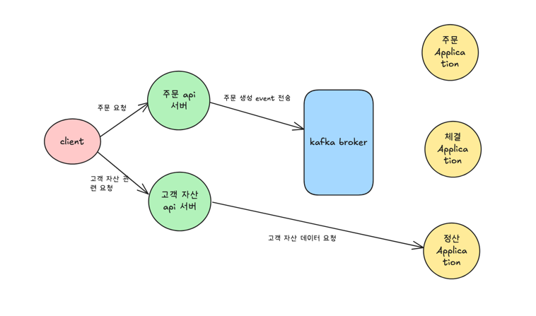

# 주문 API 서버와 고객 자산 API 서버 분리 이유

---

이 글은 프로젝트에서 주문 요청을 처리하는 주문 API 서버와 고객 자산을 확인하는 
고객 자산 API 서버를 분리하게 된 배경과 이유를 다룹니다.
 

### 📌 현재 API 서버 구조도:

  

### 📌 API 서버 분리 이유:
현재 프로젝트의 API 서버는 주문 요청을 처리하는 주문 API 와 고객 자산을 조회하는 고객 자산 API 로 분리되어 있습니다.
초기에는 단일 API 서버로 모든 요청을 처리했으나, 개발 과정에서 두 기능의 동작 방식이 근본적으로 다르다는 점을 확인했습니다. 
주문 처리는 주로 Kafka 를 이용한 비동기 이벤트 발행인 반면, 고객 자산 조회는 정산 시스템으로부터의 동기적 응답이 필수적이었습니다.
 

결론적으로 두 기능은 처리 방식과 의존하는 시스템이 근본적으로 달라 하나의 API 서버로 구현할 경우 잠재적인 위험을 안고 
있다고 판단했습니다. 만약 정산 애플리케이션에 문제가 생겨 고객 자산 조회 API 의 응답이 지연되면, 해당 서버의 스레드와 
커넥션 자원이 모두 소진될 수 있습니다. 이는 정상적으로 동작해야 할 주문 기능까지 처리 불가능한 상태로 만드는 장애 전파로
이어질 수 있습니다. 이러한 위험은 애플리케이션의 안정성에 심각한 영향을 줄 수 있으므로, 두 기능을 각각의 API 서버로 
분리하여 구성하기로 결정했습니다.
  

### 📌 API 서버 분리로 얻을 수 있는 장점:
API 서버 분리의 가장 명확한 장점은 장애 격리가 가능하다는 점입니다. 즉, 정산 애플리케이션에 장애가 발생하더라도, 그 영향이 
핵심 기능인 주문 처리 시스템까지 전파되는 것을 원천적으로 차단할 수 있습니다. 이를 통해 특정 기능의 문제가 시스템 전체의 마비로
이어지는 최악의 상황을 방지하고, 애플리케이션의 전반적인 안정성과 가용성을 크게 향상시킬 수 있습니다.
 

두 번째 장점은 독립적인 확장성확보입니다. 주문 처리와 자산 조회 기능은 트래픽 패턴이 서로 다를 수 있습니다. 예를 들어,
주문 처리 기능은 트래픽이 급증하여 더 많은 리소스가 필요할 수 있지만, 정산 기능은 상대적으로 트래픽 변화가 적을 수 있습니다.
API 서버를 분리하면 각 기능의 부하와 요구사항에 맞춰 개별적으로 서버를 증설하거나 축소할 수 있어, 전체 시스템의 효율적인 리소스
관리와 비용 최적화가 가능해집니다.
 

마지막으로, 개발 및 배포의 유연성이 크게 향상됩니다. 각 서버는 독립적인 배포 단위가 되므로, 특정 기능의 변경이 다른 기능에 영향을 
미치지 않습니다. 예를 들어, 자산 조회 로직을 수정하더라도 주문 처리 시스템의 안정성을 해치지 않고 해당 서버만 안전하게 배포할 수 있습니다.
이는 팀이 맡은 도메인에만 집중할 수 있는 자율적인 개발 환경을 보장하고, 서비스 간의 결합도를 낮춰 전체 개발 속도를 높입니다. 결과적으로 
시스템의 유지보수성을 향상시키고, 변화에 빠르게 대응할 수 있는 견고한 아키텍처를 완성하게 됩니다.

---

 
결론적으로 API 서버 분리는 단순한 구조 변경이 아닌, 서비스의 안정성과 비즈니스의 민첩성을 모두 확보하기 위한 선택이었습니다.
장애 발생 위험을 최소화하여 고객에게 안정적인 서비스를 제공하는 동시에, 변화하는 요구사항에 맞춰 각 기능을 빠르고 독립적으로 개발하고 
확장할 수 있게 되었습니다. 이러한 유연성은 장기적으로 서비스의 경쟁력을 높이는 핵심 요소가 될 것이라고 생각합니다.

