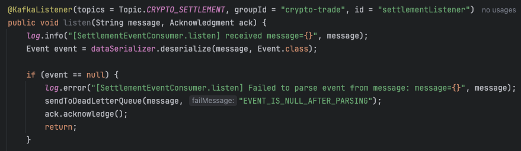
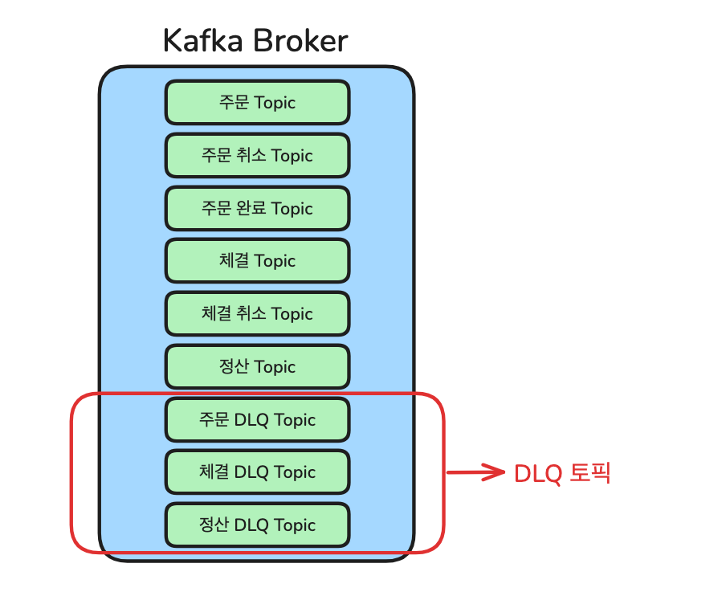

# DLQ (Dead Letter Queue) 토픽으로 처리 실패 메세지 전송하기

---

이 글은 카프카 메시지가 어떤 이유로든 최종 목적지까지 정상적으로 전달되지 못하거나 처리되지 않았을 경우, 
이러한 '실패 메시지'를 어떻게 다룰지에 대한 저의 고민과 해결 과정을 공유합니다.  

본 프로젝트는 이벤트 기반의 마이크로서비스 아키텍처로 구성되어 있습니다. 따라서 비동기적으로 메시지를 처리하는 
과정에서 다양한 원인으로 실패가 발생할 수 있습니다. 예를 들어 비즈니스 로직 오류, 일시적인 네트워크 장애,
카프카 브로커 문제, 또는 컨슈머가 처리할 수 없는 잘못된 형식의 메시지 수신 등이 그 원인입니다.  

#### ✨ 예시:

분산 시스템 환경에서 특정 메시지 하나의 처리가 실패했다고 해서 전체 시스템이 멈추거나 해당 메시지가 
유실되어서는 안 됩니다. 이러한 장애 상황에 안정적으로 대응하고 시스템의 신뢰성을 높일 수 있는 방법을 고민한 
결과 DLQ(Dead Letter Queue) 토픽을 도입했습니다. 메시지 처리 실패 시, 관련된 오류 정보와 함께 메시지를
별도의 DLQ 토픽으로 전송하고, 기존 컨슈머는 정상적으로 오프셋을 커밋하여 다음 메시지를 순차적으로 처리하도록
구현했습니다.
  

--- 

현재 프로젝트에서는 애플리케이션별로 DLQ 토픽을 분리하여, 실패 이벤트가 각각의 DLQ로 전송되도록 구성했습니다.  

이렇게 쌓인 DLQ 메시지들은 다양하게 활용될 수 있습니다. 우선, 사용자나 개발자에게 알림을 보내 장애 상황을 
신속하게 전파할 수 있습니다. 또한, DLQ를 주기적으로 모니터링하며 원인을 분석한 뒤, 수동으로 재처리하거나
데이터를 수정하여 다시 발행하는 등 적극적인 후속 조치가 가능합니다. 물론, 분석 후 보관할 필요가 없는 메시지는 
기록만 남기고 삭제할 수도 있습니다.  

현재는 DLQ 토픽으로 메시지를 전송하는 단계까지 구현되어 있지만, 앞으로 이러한 후속 처리 방안을 구체화한다면 
예외 상황에 더욱 효과적으로 대응하며 시스템의 견고함을 한층 더 높일 수 있을 것입니다.

