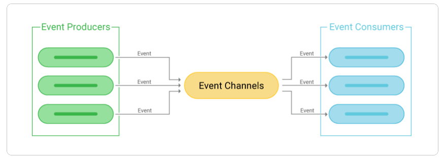

# 이벤트 드리븐 아키텍처 채택 이유와 Kafka vs RabbitMQ 

--- 

이 글에서는 프로젝트 아키텍처로 이벤트 드리븐 방식을 채택한 이유를 설명합니다. 
또한, 여러 메시지 시스템 중 Kafka와 RabbitMQ를 비교 검토하고 최종적으로 Kafka를 선택하게 된
과정을 다룹니다.   

### 📌 이벤트 드리븐 아키텍처 채택 이유:
본 가상 자산 거래소 프로젝트는 '주문 → 체결 → 정산'의 흐름으로 구성됩니다. 이 기능들을 하나의 
시스템으로 통합 관리할 경우, 여러 기술적인 한계가 발생합니다.  

예를 들어, 정산 기능의 작은 오류가 주문 및 체결 시스템 전체를 마비시키는 단일 장애점이 될 수 있어
안정성이 크게 저하됩니다. 또한 주문량이 급증할 때, 불필요한 기능까지 함께 확장해야 하므로 확장성이 
떨어지고 자원이 낭비됩니다. 이 외에도 성능 병목, 느린 개발 속도와 배포 등 명확한 단점들이 존재합니다.  

이러한 문제들로 인해서 각 서비스를 독립적으로 개발, 배포, 확장하여 시스템 전체의 유연성과 안정성을 
극대화할 수 있는 이벤트 드리븐 아키텍처를 채택하게 되었습니다.
  

### 📌 이벤트 드리븐 아키텍처:

 

그럼 간단하게 이벤트 드리븐 아키텍처에 대해 살펴보겠습니다.  

이벤트 드리븐 아키텍처는 시스템의 여러 부분이 '이벤트'를 통해 서로 통신하는 소프트웨어 설계 방식입니다.
어떤 사건이 발생했다는 사실, 즉 '이벤트'가 생기면 이를 필요로 하는 다른 부분에 전달하여 작업을 처리하게 
하는 구조입니다. 이는 한 부분에서 다른 부분을 직접 호출하는 전통적인 요청-응답 방식과 달리, 서비스 간의 
의존성을 크게 낮추는 느슨한 결합이 가장 큰 특징입니다.  

하지만 이벤트 드리븐 방식에도 장단점이 존재합니다.
#### 장점:
- 확장성과 유연성: 서비스들이 독립적으로 작동하므로, 특정 서비스에 부하가 몰리면 해당 서비스만 확장하면
됩니다. 또한 새로운 기능을 추가할 때도 기존 시스템에 미치는 영향을 최소화하며 유연하게 추가할 수 있습니다.
- 높은 회복탄력성: 하나의 서비스에 장애가 발생하더라도, 이벤트 브로커가 이벤트를 보관하고 있다가 서비스가 
복구되면 전달할 수 있습니다. 이로 인해 전체 시스템의 장애로 확산될 가능성이 작아집니다.
- 비동기 통신: 이벤트를 발생시킨 후 응답을 기다리지 않고 다음 작업을 수행할 수 있어 시스템 전체의 응답 
속도와 처리 효율이 향상됩니다. 실시간 데이터 처리나 대규모 트래픽 처리에 매우 유리합니다.

#### 단점:
- 복잡성 증가: 이벤트의 흐름을 한눈에 파악하기 어렵고, 전체 시스템의 동작을 예측하고 디버깅하기가 더 
복잡해질 수 있습니다.
- 데이터 일관성 유지의 어려움: 데이터를 비동기적, 분산적으로 처리하므로 여러 서비스에 걸친 데이터의 최종 
일관성을 보장하기 위한 추가적인 설계(예: Saga 패턴)가 필요합니다.
- 이벤트 브로커에 대한 높은 의존성: 모든 통신의 중심인 이벤트 브로커에 장애가 발생하면 전체 시스템이 멈출
수 있습니다. 따라서 브로커 자체의 고가용성을 확보하는 것이 매우 중요합니다.

이러한 장단점을 고려했을 때, 이벤트 드리븐 아키텍처는 기존 단일 시스템 방식의 문제점을 해결하고, 실시간 데이터
처리가 핵심인 가상자산 거래소 프로젝트에 가장 적합한 구조라고 판단했습니다.

---

### 📌 kafka 선택 이유:
이벤트 드리븐 아키텍처를 도입하기로 결정한 후, 대표적인 메시지 시스템인 카프카와 래빗엠큐를 비교하며
본 프로젝트에 더 적합한 솔루션이 무엇일까를 고민했습니다. 두 시스템의 가장 근본적인 차이는 메시지를 
저장하고 관리하는 방식에 있었습니다.  

래빗엠큐는 전통적인 메시지 브로커로서, 메시지를 큐 형태로 관리합니다. 프로듀서가 보낸 메시지는 큐에 
쌓이고, 컨슈머가 이 메시지를 가져가면 즉시 삭제되는 구조입니다. 이 방식은 주로 메모리에서 동작하여 
속도가 빠르고, 브로커가 메시지 삭제까지 책임지므로 컨슈머의 구현이 비교적 간단하다는 장점이 있습니다.  

반면 카프카는 메시지를 로그 형태로 디스크에 저장합니다. 마치 데이터베이스의 로그 파일처럼, 메시지들은
순서대로 기록되며 컨슈머가 읽어 가도 삭제되지 않고 정해진 기간 동안 보관됩니다. 이로 인해 컨슈머는 
자신이 마지막으로 읽은 메시지의 위치, 즉 오프셋을 직접 기억하고 관리해야 하는 복잡성이 따릅니다. 
하지만 이는 브로커의 부담을 줄여주고, 디스크에 데이터를 저장함으로써 메시지 유실 위험을 크게 낮추는 
결과를 가져옵니다. 필요하다면 컨슈머는 특정 지점의 메시지를 몇 번이고 다시 읽을 수 있어, 장애 발생 시 
복구에 매우 유리합니다.  

이러한 구조적 차이는 특히 확장성과 클러스터링 환경에서 중요한 차이를 만들어냈습니다. 래빗엠큐는 메시지의
소비 및 삭제 상태까지 클러스터의 모든 노드에 실시간으로 동기화해야 하므로 분산 환경 구성이 상대적으로 
까다롭습니다. 하지만 카프카는 각 노드가 로그 데이터만 동기화하면 되고, 메시지 소비 상태는 전적으로 
컨슈머가 관리하기 때문에 분산 시스템을 구성하고 확장하는 데 훨씬 유리했습니다.  

물론 래빗엠큐는 복잡한 조건에 따라 메시지를 선별적으로 라우팅하거나, 여러 작업자에게 일을 분배하는 
작업 큐 모델에 강력한 모습을 보입니다. 그러나 우리 시스템이 목표로 하는 것은 대용량의 데이터를 안정적으로 
처리하기 위한 높은 처리량과 수평적 확장성이었습니다.  

결론적으로, 컨슈머 구현의 복잡성을 감수하더라도 대규모 분산 환경에서 뛰어난 성능과 데이터 내구성을 보장하고,
손쉬운 확장이 가능한 카프카가 본 프로젝트의 방향성에 더 부합한다고 판단하여 최종적으로 선택하게 되었습니다.

