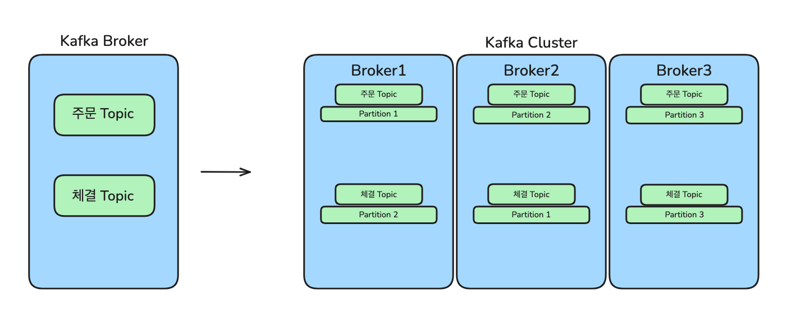
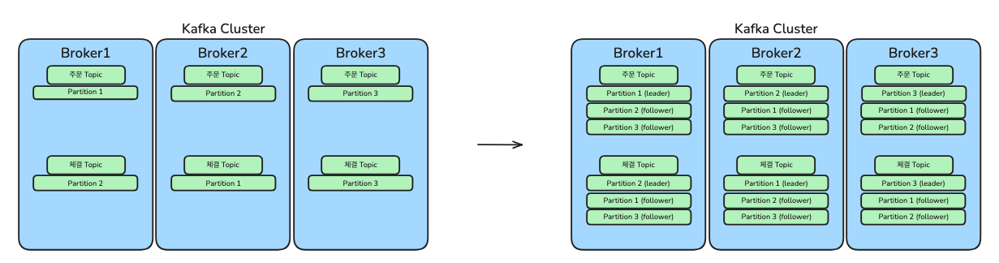

# 대용량 트래픽을 위한 카프카 아키텍처 설계하기

---

수많은 데이터가 실시간으로 발생하는 프로덕션 환경에서, 안정적이고 확장 가능한 메시징 시스템을 구축하는
것은 매우 중요합니다. 카프카는 대용량 데이터를 처리하는 데 강력한 성능을 보이지만, 하나의 브로커만으로는 
증가하는 트래픽과 장애 상황에 모두 대응하기 어렵습니다.

이 글은 여러 대의 카프카 브로커를 엮어 클러스터를 구성하고, 이를 통해 처리량과 안정성을 동시에 확보하는
핵심적인 설계 원칙에 대해 설명합니다.

### 📌 파티션을 이용한 병렬 처리

처리해야 할 데이터가 많아지면 브로커 한 대의 CPU, 디스크, 네트워크 자원은 금세 한계에 부딪힙니다.
카프카는 여러 대의 브로커를 하나로 묶어 클러스터를 구성함으로써 이 문제를 해결합니다. 클러스터링을
통해 전체 시스템의 처리량을 선형적으로 늘릴 수 있습니다.

데이터를 병렬로 처리하는 핵심 단위는 파티션입니다.
- 토픽: 데이터가 발행되는 논리적인 채널 또는 구분 단위입니다.
- 파티션: 토픽을 구성하는 물리적인 데이터 저장소입니다. 하나의 토픽은 여러 개의 파티션으로 나뉠 수 있으며,
이 파티션들이 클러스터 내 여러 브로커에 분산되어 저장됩니다.

예를 들어, 주문 토픽의 파티션 개수가 3개이고 브로커가 3대라면, 각 브로커는 하나의 파티션을 담당하여 데이터를
병렬로 처리하게 됩니다. 이처럼 파티션을 늘리고 여러 브로커에 분산시킴으로써 카프카는 엄청난 처리량을 달성할 수 있습니다.

### 📌 데이터 순서 보장하기

데이터를 여러 파티션에 분산하면 처리량은 높아지지만, 데이터의 처리 순서가 중요할 때는 어떻게 해야 할까?
예를 들어, 특정 사용자의 모든 주문은 발생한 순서대로 처리되어야 합니다. 카프카 프로듀서는 메시지를 보낼 때 
어떤 파티션으로 보낼지 결정할 수 있습니다. 

- 키 지정: 메시지에 특정 키(예: user_id)를 지정하면, 동일한 키를 가진 메시지들은 항상 동일한 파티션으로 보내집니다.
파티션 내에서는 메시지의 순서가 보장되므로, 결과적으로 특정 키에 대한 데이터 처리 순서를 보장할 수 있습니다.
- 키 미지정 (기본 방식): 키를 지정하지 않으면 프로듀서는 라운드 로빈 방식으로 여러 파티션에 메시지를 균등하게 
분산시킵니다. 이는 처리량을 극대화하는 데 유리하지만, 메시지 간의 순서를 보장하지는 않습니다.

따라서 순서 보장이 필요한 데이터는 키를 지정하고, 순서와 무관한 데이터는 키 없이 보내는 전략을 통해 유연하게 시스템을
설계할 수 있습니다.

### 📌 무중단 운영을 위한 가용성 확보: 데이터 복제

클러스터를 운영하다 보면 특정 브로커에 장애가 발생하는 상황은 피할 수 없습니다. 만약 어떤 파티션의 데이터를 단 하나의
브로커만 들고 있다면, 그 브로커의 장애는 곧 데이터 유실과 서비스 중단으로 이어집니다. 카프카는 복제(Replication) 
기능을 통해 이러한 문제를 해결하고 높은 가용성을 보장합니다.

토픽을 생성할 때 replication factor(복제 계수)를 설정할 수 있습니다. 예를 들어 이 값을 3으로 설정하면,
모든 파티션은 원본 1개와 복제본 2개, 총 3개의 데이터를 갖게 됩니다.

- 리더(Leader): 각 파티션의 원본 데이터를 가진 브로커입니다. 모든 읽기와 쓰기 요청은 리더를 통해서만 이루어집니다.
- 팔로워(Follower): 리더의 데이터를 그대로 복제하여 가지고 있는 브로커입니다. 평소에는 데이터 동기화만 수행하다가 
리더에게 장애가 발생하면 새로운 리더가 될 준비를 합니다.

만약 특정 파티션의 리더 역할을 하던 브로커에 장애가 발생하면, 카프카 클러스터는 즉시 정상 상태인 팔로워 중 하나를 
새로운 리더로 선출합니다. 이 장애 극복 과정은 자동으로 일어나므로, 약간의 지연은 있을 수 있지만 데이터 유실 없이 
메시지 생산과 소비를 지속할 수 있습니다.

---

이처럼 카프카는 파티셔닝을 통한 확장성과 복제를 통한 가용성이라는 두 가지 핵심 원칙을 통해 대규모 프로덕션 환경에서도
안정적으로 동작하는 강력한 분산 메시징 시스템을 구축할 수 있도록 지원합니다.

