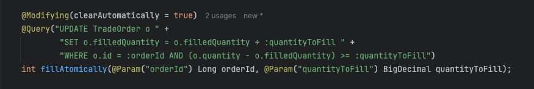
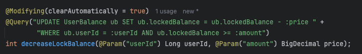

# 주문, 체결, 정산 과정에서 발생하는 동시성 문제 해결

---

이 글에서는 가상 자산 거래 프로젝트의 핵심 로직인 주문, 체결, 정산 과정에서 발생하는 동시성 이슈를 식별하고,
이를 해결한 과정을 기술합니다.
  

### 📌 동시성 이슈가 발생하는 핵심 구간:
사용자의 자산을 다루는 거래 시스템에서는 데이터의 정합성과 무결성이 매우 중요합니다. 하지만 여러 요청이
동시에 처리될 때, 본 프로젝트의 다음과 같은 구간에서 동시성 문제가 발생할 수 있습니다.

### 1. 매수/매도 주문 생성 시 자산 동결
사용자가 매수/매도 주문을 생성하면, 거래가 체결되기 전까지 해당 자산을 다른 곳에 사용할 수 없도록 동결해야 합니다.
- 매수 주문: 사용자의 잔액을 확인하고, 주문 금액만큼을 lockBalance로 설정하여 동결하는 과정에서 여러 
요청이 동시에 발생하면 데이터 부정합이 생길 수 있습니다.
- 매도 주문: 사용자가 보유한 가상 자산을 확인하고, 주문 수량만큼 lockQuantity를 설정하는 과정 역시 
동일한 동시성 문제에 노출됩니다.

### 2. 체결 수량(filledQuantity) 업데이트
- 하나의 주문이 여러 건으로 분할 체결될 때, 각 체결 건이 동시에 filledQuantity를 업데이트하면 일부 체결
내역이 누락될 수 있습니다.

### 3. 정산 시 사용자 잔고 업데이트
- 체결이 완료된 여러 주문에 대한 정산이 동시에 진행될 경우, 사용자의 최종 잔고(원화 또는 가상 자산)를 업데이트하는
과정에서 데이터가 올바르게 반영되지 않는 문제가 발생할 수 있습니다.
  

### 📌 각 구간 별 동시성 문제 해결 과정:
주문 생성, 체결, 정산 과정에서는 각기 다른 비즈니스 로직과 상황으로 인해 다양한 동시성 문제가 발생할 수 있습니다.
따라서 각 구간의 특성을 고려하여 서로 다른 해결 방법을 적용했습니다.  

첫 번째로, 매수/매도 주문 생성 단계에서는 한 명의 사용자가 거의 동시에 매수와 매도 주문을 요청할 때 동시성 문제가 
발생할 수 있습니다. 하지만 이는 실제 서비스에서 발생하기 매우 드문, 경합 조건이 지극히 한정적인 상황입니다.
이러한 특수성을 고려하여, 사용자의 잔액을 조회하는 시점에 비관적 락(Pessimistic Lock)을 적용하는 것만으로도
문제를 충분히 해결할 수 있다고 판단했습니다.  

다음으로는 체결 수량의 업데이트를 진행하는 경우입니다. 하나의 대량 매수 주문에 다수의 매도 주문이 동시에 체결되는
상황을 가정해 보겠습니다. 이 경우, 경합 조건이 지극히 한정적이었던 매수/매도 주문 생성 단계와는 달리 경합 조건이 
빈번하게 발생할 수 있습니다. 만약 비관적 락을 사용하면, 수많은 매도 주문 트랜잭션이 단일 매수 주문에 대한 락을 
기다리게 되어 시스템 전체의 성능이 크게 저하될 수 있습니다.  

#### ✨ 예시:

이러한 문제를 해결하기 위해 체결 주문 건들을 조회하는 시점에는 락을 걸지 않고 체결 주문 건들을 조회한 후 매칭 로직을
수행합니다. 그 후, filledQuantity를 업데이트하는 마지막 단계에서 Atomic Update Query를 사용하여 데이터베이스가
내부적으로 이 과정을 원자적으로 처리하게 함으로써 꼭 필요한 부분에 아주 짧은 시간 동안만 락을 허용하도록 하여 성능 저하 
문제를 예방하였습니다.

#### ✨ 예시:

마지막으로 정산 과정에서 사용자 잔고를 업데이트할 때도 비슷한 문제가 발생합니다. 한 사용자의 여러 주문 건이 동시에 
체결되어 잔고에 반영될 때, 해당 사용자의 잔고 데이터에 경합이 집중될 수 있습니다. 이 문제 역시 비관적 락을 사용할 
경우 심각한 성능 저하가 우려되므로, 앞선 체결 수량 업데이트와 동일한 방식을 적용했습니다. 즉, 사용자의 잔고를 변경하는
핵심 시점에 'Atomic Update Query'를 실행하여 락 보유 시간을 최소화함으로써, 데이터의 정합성을 지키면서 높은
동시성을 확보했습니다.

---

이 프로젝트의 핵심은 상황에 맞는 최적의 동시성 제어 전략을 선택하는 것이었습니다. 
- 주문 생성 (경합이 적은 구간): 비관적 락을 통해 데이터 정합성을 명확하게 보장했습니다.
- 체결 및 정산 (경합이 잦은 구간): Atomic Update를 활용해 불필요한 락 대기 시간을 줄여 성능 저하를 방지하고
처리량을 극대화했습니다.

이처럼 각 비즈니스 로직의 특성을 분석하고 그에 맞는 락 전략을 적용함으로써, 데이터 무결성을 해치지 않으면서도 
높은 처리 성능을 갖춘 안정적인 거래 시스템을 구축할 수 있었습니다. 이는 문제의 본질을 이해하고 최적의 도구를 
선택하는 엔지니어링의 중요성을 보여주는 경험이었습니다.

