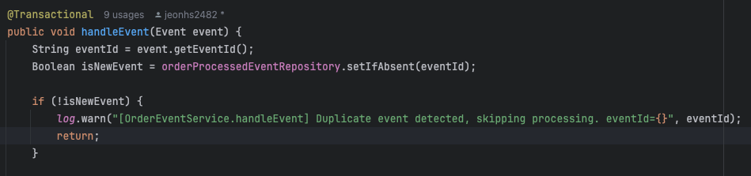

# 레디스를 활용한 카프카 중복이벤트 처리

--- 
이 글에서는 카프카 사용 시 발생할 수 있는 이벤트 중복 발행 문제를 레디스를 활용해 해결하고,
멱등성을 보장하는 설계 과정을 다룹니다.  

카프카는 높은 처리량을 보장하는 분산 스트리밍 플랫폼이지만, '최소 한 번 이상(At-least-once)'
전달을 보장하는 특성상 이벤트 중복이 발생할 수 있습니다. 이는 주로 프로듀서의 재시도나 네트워크 
장애로 인해 나타납니다.  

프로듀서의 enable.idempotence 설정을 통해 일부 중복을 방지할 수 있지만, 이는 완벽한 해결책이
아닙니다. 애플리케이션 레벨의 로직 오류나 컨슈머의 오프셋 커밋 문제로 인해 컨슈머 단에서 동일한 
메시지를 여러 번 처리하는 상황은 여전히 발생하기 때문입니다.  

따라서 가장 안정적인 방법은 컨슈머의 처리 로직 자체를 멱등(Idempotent)하게 설계하여, 동일한 
이벤트가 반복적으로 수신되어도 결과에 영향을 주지 않도록 만드는 것입니다. 저는 이 멱등성 구현을 
위해 레디스를 사용하기로 결정했습니다.
  

### 📌 이벤트 중복 방지 멱등성 설계:
카프카 메세지로 주고 받는 이벤트 객체에는 고유한 id가 존재합니다. 저는 이벤트 처리 전에 이 고유 id를
확인하는 방법으로 멱등성을 설계했습니다. 컨슈머는 로직 처리 전 id를 조회하여, 이미 수신된 id이면 로그
를 남기고 리턴하고, 새로운 id일 때만 비즈니스 로직을 실행합니다.  

#### ✨ 예시:

하지만 만약 이 id 확인 로직을 일반적인 DB에서 수행한다면, 매 이벤트마다 발생하는 DB 조회 및 쓰기 
작업이 프로덕션 환경에서 큰 부하를 일으킬 것입니다. 따라서 프로덕션 환경의 대용량 트래픽을 감당하기 위해
디스크 기반 DB 대신 인메모리 기반의 레디스를 선택했습니다. 레디스는 훨씬 낮은 지연 시간으로 ID 조회
및 저장이 가능하므로, 높은 처리량이 요구되는 시스템에서도 효율적으로 멱등성을 보장할 수 있기 때문입니다.  

또한 레디스 장애 시 데이터 유실로 멱등성이 깨지는 것을 막기 위해 성공적으로 처리된 이벤트 id는 DB에도 
기록하여 이중으로 관리하도록 하였습니다. 이는 새로운 이벤트 처리 시 db에 쓰는 작업을 한번 진행 하지만,
모든 중복 검사는 레디스에서 빠르게 처리하고, DB는 데이터 영속성을 보장하는 역할만 하므로 성능과 안정성을
모두 확보할 수 있는 효율적인 구조입니다.

--- 

이 설계의 핵심은 각 기술의 장점을 극대화하여 성능과 안정성을 모두 확보하는데에 있습니다.  

- 성능: 빈번하게 발생하는 중복 확인 작업은 빠른 인메모리 저장소인 레디스가 전담하여 시스템의 처리량을 극대화합니다.
- 안정성: 예측 불가능한 장애 상황에 대비한 데이터 영속성은 안정적인 DB가 책임져 장애 허용 시스템을 완성합니다.

결론적으로, 이 방식은 단순히 카프카의 이벤트 중복을 막는 것을 넘어, 대용량 트래픽을 처리하는 서비스가 갖춰야 할 
확장성과 신뢰성을 동시에 확보하는 실용적인 방법이라고 할 수 있습니다.

