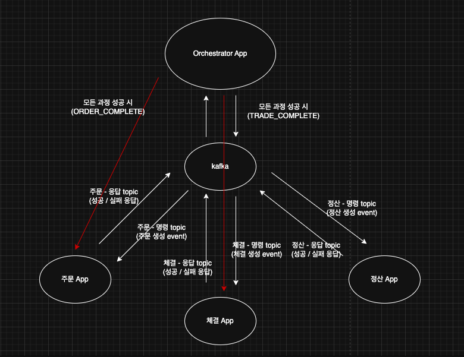
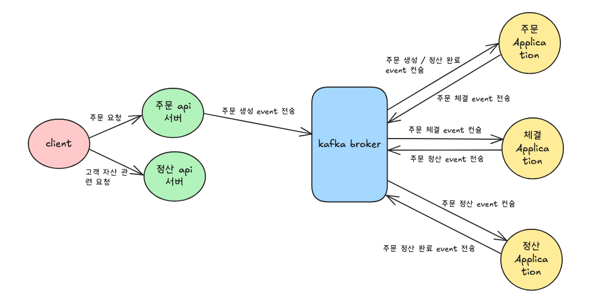

# 보상 트랜잭션 구현과 Saga 패턴의 적용

---
이 글은 이벤트 기반 마이크로서비스 아키텍처 프로젝트에서 비즈니스 로직 실패 시 데이터 일관성을 보장하기 위한 고민과
해결 과정을 담고 있습니다.
 

프로젝트를 마이크로서비스 아키텍처로 구현하다 보니, 여러 서비스 간의 데이터 정합성 문제가 발생했습니다. 가령 주문 
애플리케이션에서 주문을 생성했더라도, 이후 단계인 체결 애플리케이션에서 비즈니스 로직이 실패하면 이전에 생성된 주문을 
취소하는 작업이 필요했습니다. 이때 주로 사용되는 해결책이 바로 Saga 패턴입니다.
 

Saga 패턴이란, 여러 마이크로서비스가 이벤트를 통해 상호작용할 때, 특정 서비스의 작업이 실패하면 이전까지 성공적으로
작업을 마친 서비스들에게 보상 이벤트를 전송하여 전체 프로세스를 원자적으로 처리하는 패턴입니다. 이를 통해 분산 환경에서도
데이터 일관성을 효과적으로 보장할 수 있습니다. 일반적으로 Orchestration 과 Choreography 의 두가지 패턴으로 
Saga 패턴을 구현할 수 있습니다.  

그럼 간단하게 두가지 패턴에 대해 살펴보겠습니다.
  

### 📌 Orchestration 패턴:

 

오케스트레이션 패턴은 중앙 컨트롤러, 즉 '오케스트레이터(Orchestrator)'가 전체 분산 트랜잭션의 흐름을 지휘하고 관리하는 방식입니다.
#### 동작 방식:
1. 시작: 클라이언트의 요청을 받은 오케스트레이터가 분산 트랜잭션의 첫 번째 단계를 담당하는 서비스에 요청을 보냅니다.
2. 순차적 실행: 첫 번째 서비스가 성공적으로 작업을 마치면, 오케스트레이터에게 성공을 알립니다. 그러면 오케스트레이터는 다음 단계를 
담당하는 서비스에 요청을 보냅니다. 이 과정이 마지막 단계까지 반복됩니다.
3. 실패 처리 (보상 트랜잭션): 만약 트랜잭션 중간에 어떤 서비스가 작업을 실패하면, 해당 서비스는 오케스트레이터에게 실패를 알립니다. 
그러면 오케스트레이터는 이미 성공적으로 처리된 이전 단계의 작업들을 모두 취소하라는 보상 트랜잭션 명령을 역순으로 각 서비스에 내립니다.

오케스트레이션 패턴은 중앙 관리 시스템(오케스트레이터)이 전체 트랜잭션의 상태와 흐름을 통제하므로, 문제 발생 시 추적이 용이하다는 장점이 있습니다.
 
하지만 다음과 같은 단점도 존재합니다.
- 단일 실패 지점: 오케스트레이터 자체에 장애가 발생하면 전체 서비스가 중단될 수 있습니다.
- 높은 서비스 간 결합도: 개별 서비스가 오케스트레이터와 강하게 결합됩니다. 이 때문에 특정 서비스의 로직 변경이 전체 프로세스에 미칠 영향을 
항상 고려해야 하므로 유연성이 떨어집니다.
  

### 📌 Choreography 패턴:

 

코레오그래피(Choreography) 패턴은 중앙 관제탑 없이, 각 서비스가 이벤트를 통해 자율적으로 소통하며 분산된 트랜잭션을 처리하는 패턴입니다.
#### 동작 방식:
코레오그래피 패턴은 이벤트 발행과 구독 모델을 기반으로 동작합니다. 중앙 지휘자가 없으며, 각 서비스는 자신의 역할을 수행한 뒤 결과를 이벤트로 
발행할 뿐입니다.
1. 첫 번째 작업 및 이벤트 발행: 첫 번째 서비스가 자신의 로컬 트랜잭션을 완료하고, 주문 생성과 같은 이벤트를 메세지 브로커에 발행합니다.
2. 이벤트 구독 및 다음 작업 수행: 다음 서비스는 주문 생성 이벤트를 구독하고 있다가, 이벤트가 발생하면 자신의 로컬 트랜잭션을 수행합니다.
작업 완료 후 성공 이벤트를 발행합니다.
3. 반복: 이 과정이 트랜잭션의 마지막 단계까지 반복됩니다.
4. 실패 처리 (보상 트랜잭션): 만약 중간에 한 서비스가 작업을 실패하면 실패 이벤트를 발행합니다. 그러면 이전에 작업을 완료했던 서비스들이 
이 실패 이벤트를 구독하고 있다가, 자신의 작업을 취소하는 보상 트랜잭션을 스스로 실행합니다.

코레오그래피 패턴은 서비스들이 서로를 직접 호출하지 않고 이벤트로만 통신하므로 서비스간 의존성이 낮고, 중앙 관리자가 없으므로 특정 지점의 
장애가 전체 시스템의 중단으로 이어질 가능성이 적다는 장점이 있습니다.
 
하지만 다음과 같은 단점도 존재합니다.
- 낮은 가시성 및 복잡성: 전체 트랜잭션 흐름이 여러 서비스에 흩어져 있어 한눈에 파악하기 어렵고 디버깅이 복잡합니다.
- 순환 의존성 위험: 서비스들이 서로의 이벤트를 구독하다 보면 A → B → A 와 같은 순환 의존성이 발생할 수 있습니다.

--- 

### 📌 Choreography 적용 이유:
위에서 살펴보았듯이 두 패턴은 명확한 장단점을 가집니다.  

초기에는 트랜잭션의 상태와 흐름을 중앙에서 관리하여 문제 추적이 용이하다는 장점 때문에 오케스트레이션 패턴을 고려했습니다.
하지만 개발을 진행하며 오케스트레이션 패턴의 단점이 더 크게 다가왔습니다. 개별 서비스가 오케스트레이터와 강하게 결합되어,
하나의 기능을 수정할 때마다 전체 프로세스에 미치는 영향을 모두 확인해야 했습니다. 이는 서비스를 독립적으로 개발하고 빠르게
배포할 수 있다는 마이크로서비스(MSA)의 핵심 장점을 희석시키는 문제라고 판단했습니다.  

결론적으로, 서비스 간 결합도를 낮추고 각 서비스의 개발 자율성을 확보하기 위해 코레오그래피 패턴을 최종적으로 선택하게 되었습니다.

