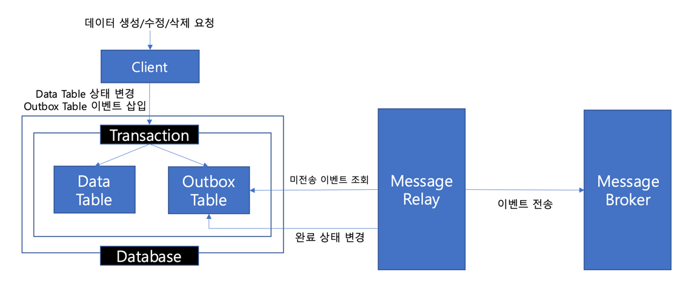

# 비즈니스 데이터와 카프카 이벤트 간 트랜잭션 문제

--- 
해당 글은 프로젝트를 진행하며 카프카를 도입하고 주문 요청 로직을 구성하던 중 직면했던
비즈니스 데이터와 카프카 이벤트 간 트랜잭션 문제에 대해 작성한 글입니다.
<br>

프로젝트 중반쯤에 이벤트 드리븐 방식으로 주문 로직을 구현하기 위해 카프카를 도입해 주문 요청 로직을
구현하기 시작했습니다. 그런데 비즈니스 데이터의 트랜잭션(주로 데이터베이스 트랜잭션)과 카프카 이벤트 
전송이 원자적으로 함께 관리되지 않는 문제에 직면했습니다. 이는 데이터베이스에 데이터를 저장하는 트랜잭션은 
성공했으나 카프카로 이벤트를 보내는 과정에서 실패하거나, 반대로 카프카 이벤트는 발행되었는데 데이터베이스 
트랜잭션이 롤백되는 경우를 포함했습니다. 이 문제를 해결할 방안을 찾던 중 트랜잭셔널 아웃박스 패턴이 
적합하다는 것을 알게 되었고, 처음에는 해당 방법으로 로직을 구현하여 해당 문제를 처리했었습니다. <br>
<br>
우선 간단하게 트랜잭셔널 아웃박스 패턴이 무엇인지에 대해 살펴보겠습니다.
<br></br>

### 📌 트랜잭셔널 아웃박스 패턴:
카프카와 같은 비동기 메세지 기반의 서비스에서는 비즈니스 로직이 실행되었을 때, 이를 표현하는 이벤트도 
온전하게 발행되는 것이 중요합니다. 위에서 설명한대로 데이터베이스에 데이터를 저장하는 트랜잭션은 성공했으나
카프카로 이벤트를 보내는 과정에서 실패하는 경우 해당 이벤트를 바라보는 컨슈머는 다음 로직을 실행할 수 없게 
되고, 이로 인해 전체 서비스의 데이터 정합성이 깨지게됩니다. 트랜잭셔널 아웃박스 패턴은 이를 방지하기 위해
다음과 같은 단계를 따릅니다.
<br>



1. 아웃박스 테이블 (Outbox Table) 생성: 
- 애플리케이션의 데이터베이스 내에 메시지(이벤트)를 임시로 저장할 전용 테이블(outbox 테이블)을 생성합니다.
이 테이블에는 발행할 이벤트의 내용, 타입, 생성 시간, 상태 등이 포함됩니다.
2. 동일 트랜잭션 내 데이터 저장 및 이벤트 기록:
- 비즈니스 로직과 동일한 데이터베이스 트랜잭션 내에서, 발행해야 할 이벤트의 정보를 outbox 테이블에 
함께 기록합니다.
3. 별도의 메시지 릴레이 프로세스:
- outbox 테이블을 지속적으로 모니터링하는 별도의 프로세스(Message Relay)를 실행합니다.
- 이 프로세스는 outbox 테이블에서 아직 발행되지 않은(PENDING 상태) 이벤트를 주기적으로 조회합니다.
- 조회된 이벤트를 메시지 브로커(Kafka)로 발행합니다.
- 이벤트 발행에 성공하면, outbox 테이블에서 해당 이벤트의 상태를 변경하거나, 해당 레코드를 삭제합니다.

---
<br>

### 📌 트랜잭셔널 아웃박스 패턴의 한계
이벤트 드리븐 아키텍처의 데이터 정합성을 보장하기 위해 트랜잭셔널 아웃박스 패턴을 초기 모델로 채택했습니다.
하지만 분석 결과, Kafka 자체의 장애 발생 빈도에 비해 이 패턴이 유발하는 상시 비용과 성능 저하 문제가 더
크다는 결론에 도달했습니다.

- 과도한 리소스 비용: 모든 트랜잭션마다 outbox 테이블에 추가적인 INSERT가 발생하며, 이를 처리하기 위한 
메시지 릴레이의 주기적인 폴링은 데이터베이스에 지속적인 부하를 유발합니다.
- 고성능 환경에서의 병목: 특히 초당 수십만 건의 요청이 발생하는 프로덕션 환경을 가정했을 때, outbox 테이블에
대한 쓰기 경쟁은 시스템 전체의 병목이 될 가능성이 매우 높습니다.

따라서 이를 바탕으로 과한 비용을 들여 카프카의 장애 상황을 대비하기 보다는 최소한의 비용으로 장애 상황을 일부 대비하고
나머지 부분은 사후 처리를 통해 장애를 해결하는 방법으로 프로젝트 구성을 변경하게 되었습니다.
<br></br>

### 📌 트랜잭션 관리 구성 변경
트랜잭셔널 아웃박스 패턴의 상시 비용과 고성능 환경에서의 병목 가능성을 고려하여, 더 적은 비용으로 핵심적인
장애 상황을 방어하는 형태로 트랜잭션 관리 구성을 변경하였습니다. 이 전략의 핵심은 두 단계의 방어 로직으로 구성됩니다.

1. DB 트랜잭션과 이벤트 발행의 연동: ```@TransactionalEventListener```의 AFTER_COMMIT 설정을 활용했습니다.
이는 스프링 프레임워크가 제공하는 기능으로, 데이터베이스 트랜잭션이 성공적으로 COMMIT 된 이후에만 이벤트 발행 로직이 
실행되도록 보장합니다. 이를 통해, 도메인 로직 수행 중 오류가 발생하여 트랜잭션이 롤백되는 경우에는 이벤트가 절대로 
발행되지 않도록 하여 1차적인 데이터 정합성을 확보했습니다.

2. 카프카 브로커 장애에 대한 방어: 카프카 프로듀서의 acks=all 설정과 비동기 콜백을 조합하여 브로커 장애에 대응했습니다.
이벤트 발행 요청 후 타임아웃 등의 문제로 카프카 브로커로부터 성공 응답을 받지 못하면, 미리 정의된 콜백 함수가 실행됩니다.
이 콜백 함수 내에서 해당 이벤트에 대한 보상 트랜잭션을 실행하여 데이터 불일치를 최소화하도록 구성했습니다.

이 설계는 트랜잭셔널 아웃박스 패턴에 비해 비용이 낮은 대신, 특정 장애 상황을 완벽하게 방어하지 못하는 명확한 한계를 가집니다.
제가 인지하고 수용한 주요 리스크는 다음과 같습니다. 예를 들면 COMMIT 은 성공했지만 카프카로 발행 요청을 보내기 직전에 
애플리케이션 서버가 다운되거나 재시작되는 경우나 보상 트랜잭션 자체가 실패하는 경우입니다. <br>

위와 같은 잔여 리스크는 시스템 로직만으로 완벽히 자동 복구하기 어렵다고 판단했습니다. 따라서 장애 발생을 신속하게 탐지하고
사후에 처리하는 방향으로 구성을 변경하기로 결정했습니다. 예를 들어, 별도의 모니터링 애플리케이션을 구성하여 주문 상태 필드를
주기적으로 확인합니다. 만약 특정 주문이 일정 시간 이상 PENDING 상태로 머물러 있다면, 이를 '비정상 상태'로 간주하고 해당 
주문을 강제 취소하거나 운영팀에 알림을 보내는 식의 후속 처리를 자동화할 수 있습니다. (본 프로젝트에서는 1, 2번의 방어 로직
까지만 구현된 상태이며 해당 사후 처리 로직은 구현에 포함되지 않았습니다.) <br>

---

결론적으로 어느정도의 장애 방어 수준을 유지하고 애플리케이션의 성능을 보장할지 해당 비즈니스의 상황에 따라 적절하게 
선택하는 것이 중요하며, 가장 중요한 것은 "어떤 장애 시나리오까지 방어할 수 있고, 어떤 시나리오는 방어할 수 없는지"
를 명확하게 인지하고, 수용하지 못하는 리스크에 대해서는 신뢰할 수 있는 사후 처리 방안을 마련하는 것입니다.


