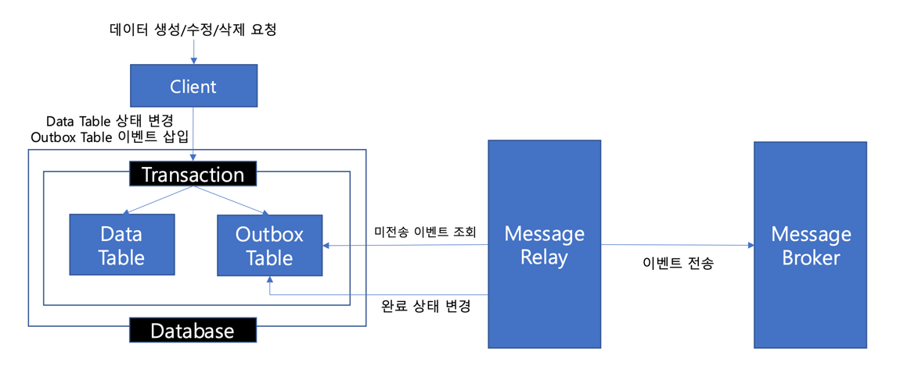

# 비즈니스 데이터와 카프카 이벤트 간 트랜잭션 문제

--- 
해당 글은 프로젝트를 진행하며 카프카를 도입하고 주문 요청 로직을 구성하던 중 직면했던
비즈니스 데이터와 카프카 이벤트 간 트랜잭션 문제에 대해 작성한 글입니다.
<br>

프로젝트 중반쯤에 이벤트 드리븐 방식으로 주문 로직을 구현하기 위해 카프카를 도입해 주문 요청 로직을
구현하기 시작했습니다. 그런데 비즈니스 데이터의 트랜잭션(주로 데이터베이스 트랜잭션)과 카프카 이벤트 
전송이 원자적으로 함께 관리되지 않는 문제에 직면했습니다. 이는 데이터베이스에 데이터를 저장하는 트랜잭션은 
성공했으나 카프카로 이벤트를 보내는 과정에서 실패하거나, 반대로 카프카 이벤트는 발행되었는데 데이터베이스 
트랜잭션이 롤백되는 경우를 포함했습니다. 이 문제를 해결할 방안을 찾던 중 트랜잭셔널 아웃박스 패턴이 
적합하다는 것을 알게 되었고, 처음에는 해당 방법으로 로직을 구현하여 해당 문제를 처리했었습니다. <br>
<br>
우선 간단하게 트랜잭셔널 아웃박스 패턴이 무엇인지에 대해 살펴보겠습니다.
<br></br>

### 📌 트랜잭셔널 아웃박스 패턴:
카프카와 같은 비동기 메세지 기반의 서비스에서는 비즈니스 로직이 실행되었을 때, 이를 표현하는 이벤트도 
온전하게 발행되는 것이 중요합니다. 위에서 설명한대로 데이터베이스에 데이터를 저장하는 트랜잭션은 성공했으나
카프카로 이벤트를 보내는 과정에서 실패하는 경우 해당 이벤트를 바라보는 컨슈머는 다음 로직을 실행할 수 없게 
되고, 이로 인해 전체 서비스의 데이터 정합성이 깨지게됩니다. 트랜잭셔널 아웃박스 패턴은 이를 방지하기 위해
다음과 같은 단계를 따릅니다.
<br>



1. 아웃박스 테이블 (Outbox Table) 생성: 
- 애플리케이션의 데이터베이스 내에 메시지(이벤트)를 임시로 저장할 전용 테이블(outbox 테이블)을 생성합니다.
이 테이블에는 발행할 이벤트의 내용, 타입, 생성 시간, 상태 등이 포함됩니다.
2. 동일 트랜잭션 내 데이터 저장 및 이벤트 기록:
- 비즈니스 로직과 동일한 데이터베이스 트랜잭션 내에서, 발행해야 할 이벤트의 정보를 outbox 테이블에 
함께 기록합니다.
3. 별도의 메시지 릴레이 프로세스:
- outbox 테이블을 지속적으로 모니터링하는 별도의 프로세스(Message Relay)를 실행합니다.
- 이 프로세스는 outbox 테이블에서 아직 발행되지 않은(PENDING 상태) 이벤트를 주기적으로 조회합니다.
- 조회된 이벤트를 메시지 브로커(Kafka)로 발행합니다.
- 이벤트 발행에 성공하면, outbox 테이블에서 해당 이벤트의 상태를 변경하거나, 해당 레코드를 삭제합니다.

---
<br>

### 📌 트랜잭셔널 아웃박스 패턴의 한계
트랜잭셔널 아웃박스 패턴을 채택하여 프로젝트를 진행하던 중 문득  kafka 이벤트의 전송이 실패하는 경우의 
빈도가 굉장히 낮은 것에 반해 트랜잭셔널 아웃박스 패턴은 데이터 생성시 마다 아웃박스 데이터들을 추가로 
생성해야하고, 메세지 릴레이를 구현하여 아웃박스 테이블을 주기적으로 폴링하는 등의 추가 비용이 과도하게 
발생한다는 생각이 들었습니다. 또한 사실상 실제 프로덕션 환경에서는 카프카 서버의 이중화 등으로 카프카
브로커가 전부 다운되는 상황은 없어야한다는 점에서도 트랜잭션 아웃박스 패턴을 적용시키는 것은 과한 구현이라는
생각이 들었고 과한 비용을 들여 카프카의 장애 상황을 대비하기 보다는 최소한의 비용으로 장애 상황을 일부 대비하고
나머지 부분은 사후 처리를 통해 장애를 해결하는 방법으로 프로젝트 구성을 변경하게 되었습니다.
<br></br>

### 📌 트랜잭션 관리 구성 변경
위에서 이야기한대로 과한 비용을 들여 트랜잭션 관리를 하기보다는 최소한의 비용으로 장애 상황을 일부 대비하는
방법으로 트랜잭션 관리 구성을 변경하였습니다. 
1. ```@TransactionalEventListener``` 의 AFTER_COMMIT 설정을 사용하여 트랜잭션이 성공적으로 커밋된 
후에만 이벤트 리스너가 실행되도록 해서 도메인 로직이 오류 없이 온전히 실행되었을 때에만 이벤트가 발행되는 것을 
보장하도록 하였습니다.
2. 카프카의 akcs = all 설정에 따른 타임아웃 에러를 비동기 응답으로 받아 이벤트 전송 실패 시 보상 트랜잭션을 
실행하는 로직을 적용하여 카프카 브로커 장애 상황에 대한 일부 방어 로직을 적용하였습니다.
3. 위 두가지 방법으로 트랜잭션 관리 구성을 변경하였는데, 트랜잭셔널 아웃박스 패턴에 비해 적은 비용이 들어가는 대신
해당 구성으로는 잡을 수 없는 장애 상황이 존재하게됩니다. 예를 들면 COMMIT 은 성공했지만 카프카로 발행 요청을 보내기 
직전에 애플리케이션 서버가 다운되거나 재시작되는 경우나 보상 트랜잭션 자체가 실패하는 경우입니다.
4. 따라서 이러한 예외 상황들은 장애 발생 시 해당 장애 발생을 빠르게 파악하여 사후 처리 하는 방법으로 프로젝트의 방향을 
정하게 되었습니다. 해당 프로젝트에서는 1번, 2번의 장애 대비 로직까지 구현되어있으며, 사후 처리에 대한 내용은 포함하고 
있지 않지만, 주문 생성 시 가지고 있는 주문의 상태 필드를 체크하는 별도의 애플리케이션을 구성하여 PENDING 상태로 일정
시간 이상 지속되는 주문 건에 대해 취소 요청을 하는 식의 처리를 할 수 있을 것 같습니다.

결론적으로 어느정도의 장애 방어 수준을 유지하고 애플리케이션의 성능을 보장할지 해당 비즈니스의 상황에 따라 적절하게 
선택하는 것이 중요하며, 발생할 수 있는 장애 시나리오에 대해 인지하고 있어야 한다는 점이 중요합니다.


